#Objectives
In this lab we will explore:

- Creating a new Xamarin Solution.
- Designing and creating a User Interface for our application.
- Adding a new class.
- Adding functionality to controls.
- Deploying our application to a simulator.
- Adding app icons, and other finishing touches to our application.

The final application will contain a single view, and should look like the following: 

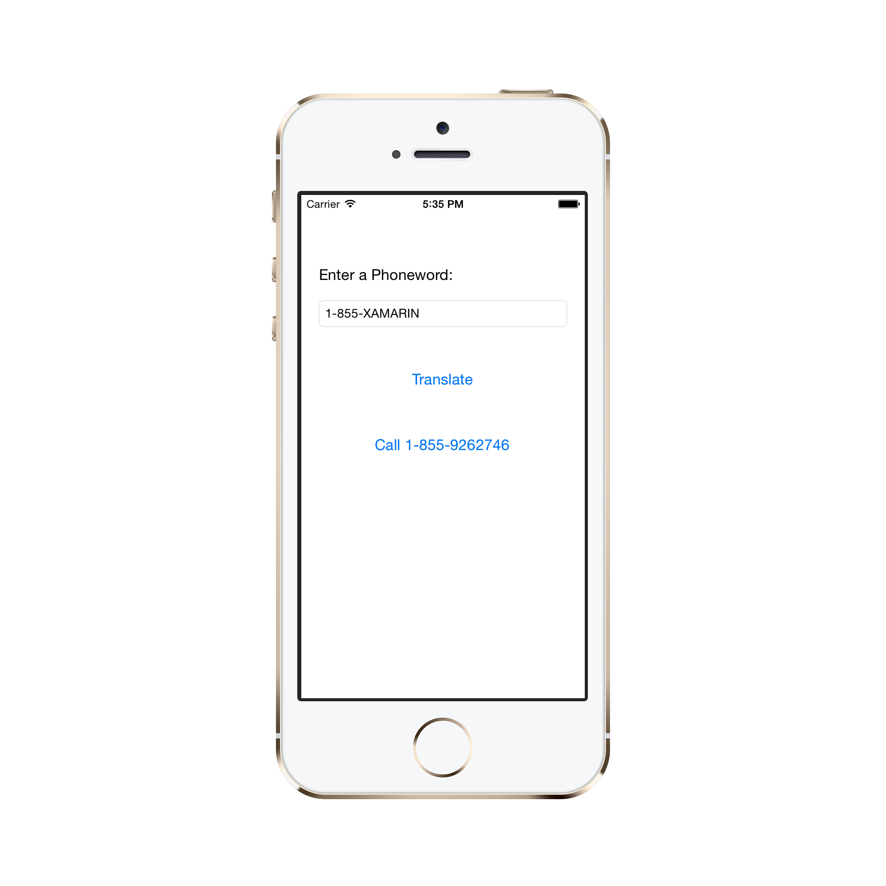


#Lab Walkthrough
1. Open Xamarin Studio, and select <strong>New Solution</strong> from the top left corner:
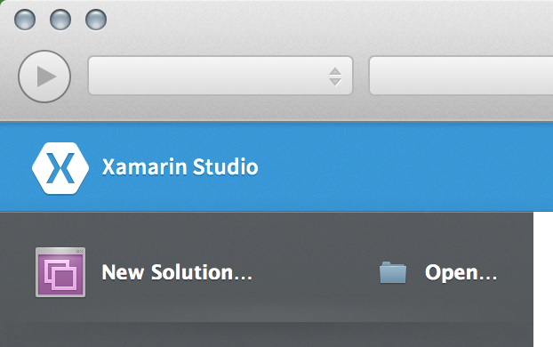
2. From the New Solution dialog, select **C# > iOS > Classic API > iPhone > Single View Application** and give it a name:
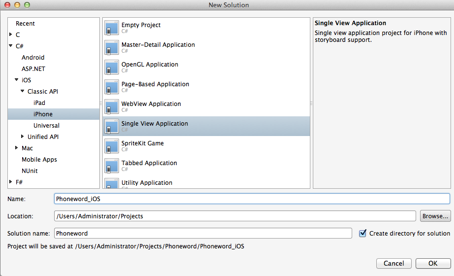		
3. Double–Click on **MainStoryboard.Storyboard** in your Solution Pad, on the left. This will open the Designer:
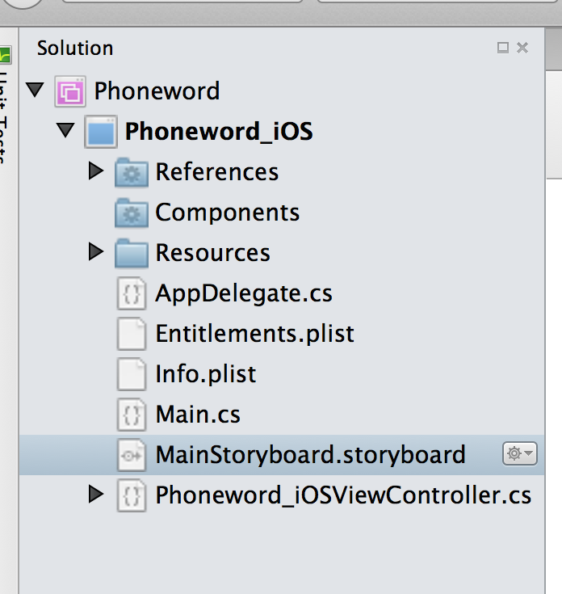
4. We now want to create the UI, which should reflect the screenshot below. We will use the **Toolbox** pad to complete this, which, by default, sits to the right of the design surface.:
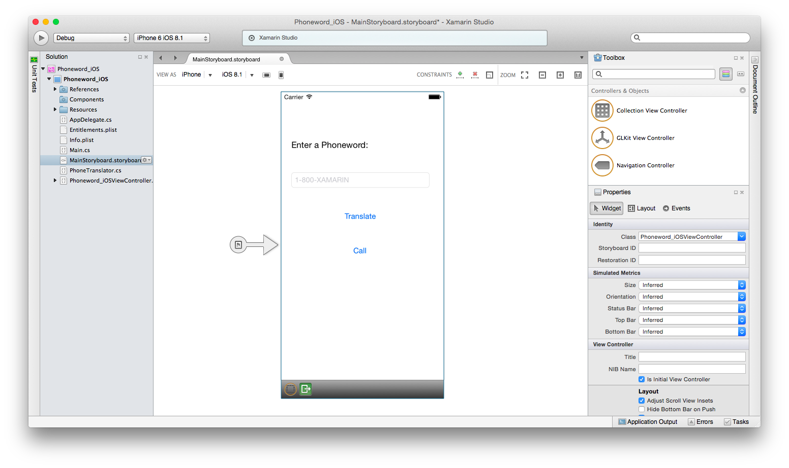
The grid below explains which controls are needed, and which properties should be set in the property pad, like so:
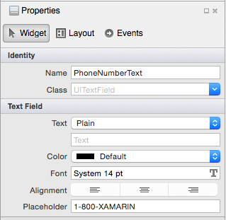 
	<table class="grid alternate-rows indent-large" width="80%">
            <tr>
                <th>Type</th>
                <th>Property</th>
                <th>Value</th>
            </tr>
            <tr>
                <td>
                    <code>Label</code>
                </td>
                <td>
                    <table>
                        <tr>
                            <td>
                                <code>Text</code>
                            </td>
                        </tr>
                        <tr>
                            <td>
                                <code>Font</code>
                            </td>
                        </tr>
                    </table>
                </td>
                <td>
                    <table>
                        <tr>
                            <td>&quot;Enter a Phoneword:&quot;</td>
                        </tr>
                        <tr>
                            <td>System Bold 17</td>
                        </tr>
                    </table>
                </td>
            </tr>
            <tr>
                <td>
                    <code>Text Field</code>
                </td>
                <td>
                    <table>
                        <tr>
                            <td>
                                <code>Name</code>
                            </td>
                        </tr>
                        <tr>
                            <td>
                                <code>Text</code>
                            </td>
                        </tr>
                    </table>
                </td>
                <td>
                    <table>
                        <tr>
                            <td>PhoneNumberText</td>
                        </tr>
                        <tr>
                            <td>&quot;1-855-XAMARIN&quot;</td>
                        </tr>
                    </table>
                </td>
            </tr>
            <tr>
                <td>
                    <code>Button</code>
                </td>
                <td>
                    <table>
                        <tr>
                            <td>
                                <code>Name</code>
                            </td>
                        </tr>
                        <tr>
                            <td>
                                <code>Title</code>
                            </td>
                        </tr>
                    </table>
                </td>
                <td>
                    <table>
                        <tr>
                            <td>TranslateButton</td>
                        </tr>
                        <tr>
                            <td>&quot;Translate&quot;</td>
                        </tr>
                    </table>
                </td>
            </tr>
            <tr>
                <td>
                    <code>Button</code>
                </td>
                <td>
                    <table>
                        <tr>
                            <td>
                                <code>Name</code>
                            </td>
                        </tr>
                        <tr>
                            <td>
                                <code>Title</code>
                            </td>
                        </tr>
                    </table>
                </td>
                <td>
                    <table>
                        <tr>
                            <td>CallButton</td>
                        </tr>
                        <tr>
                            <td>&quot;Call&quot;</td>
                        </tr>
                    </table>
                </td>
            </tr>
        </table> 
5. We can now save and run the application in the simulator. Select **Debug | iPhone 6 iOS 8.1** as the configuration, and press the play button. When the application launches, you should notice that there is currently no functioanlity on any of the buttons.
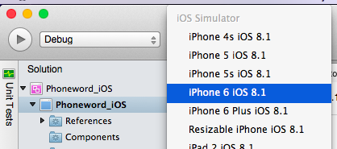
6. Let's add the logic that will  do the translating from alpha-numeric to numeric phone number. Add a new class by right–clicking on your project, and selecting **Add > New Files...** In New File dialog, select <strong> General > Empty Class</strong>, and name it `Translate`. This step is illustrated below:
 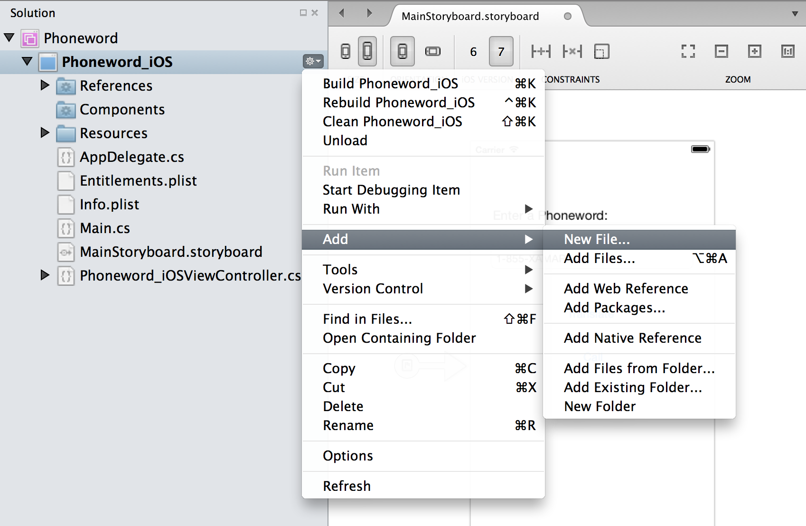
 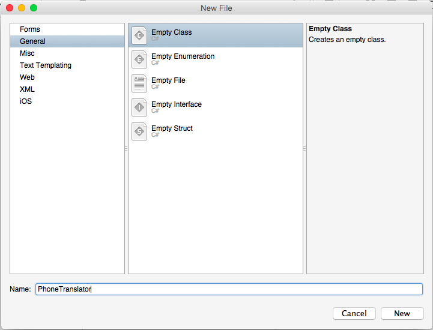
7. We now need to add the following code to this class:
	
	 ```
	using System.Text;
	using System;
	
	namespace Core
	{
		public static class PhonewordTranslator
		{
			public static string ToNumber(string raw)
			{
				if (string.IsNullOrWhiteSpace(raw))
					return "";
				else
					raw = raw.ToUpperInvariant();
	
				var newNumber = new StringBuilder();
				foreach (var c in raw)
				{
					if (" -0123456789".Contains(c))
						newNumber.Append(c);
					else {
						var result = TranslateToNumber(c);
						if (result != null)
							newNumber.Append(result);
					}    
					// otherwise we've skipped a non-numeric char
				}
				return newNumber.ToString();
			}
			static bool Contains (this string keyString, char c)
			{
				return keyString.IndexOf(c) >= 0;
			}
			static int? TranslateToNumber(char c)
			{
				if ("ABC".Contains(c))
					return 2;
				else if ("DEF".Contains(c))
					return 3;
				else if ("GHI".Contains(c))
					return 4;
				else if ("JKL".Contains(c))
					return 5;
				else if ("MNO".Contains(c))
					return 6;
				else if ("PQRS".Contains(c))
					return 7;
				else if ("TUV".Contains(c))
					return 8;
				else if ("WXYZ".Contains(c))
					return 9;
				return null;
			}
		}
	}
	
	```
The provides the functionality to translate the alpha–numeric number, into a numeric number.
   
8. Next, we want to implement an event on our Translate button. Remember that we gave the button the name **translateButton**. If we view the .Designer.cs file, notice that the button has been created with the [Outlet] property. An outlet gives the ViewController a way to talk to the View.

9. Add the following code to the `ViewDidLoad` method of the **Phoneword_iOSViewController.cs** class:

	```

	TranslateButton.TouchUpInside += (object sender, EventArgs e) => {
			
			// Convert the phone number with text to a number - from PhoneTranslator.cs
			translatedNumber = Core.PhonewordTranslator.ToNumber(PhoneNumberText.Text);
				
			// Dismiss the keyboard - if Text Field was tapped
			PhoneNumberText.ResignFirstResponder ();
				
			//Check if the number has been translated
		if (translatedNumber == "") {
			CallButton.SetTitle ("Call ", UIControlState.Normal);
			CallButton.Enabled = false;
		} else {
			CallButton.SetTitle ("Call " + translatedNumber, UIControlState.Normal);
			CallButton.Enabled = true;
		}
	};
```
10. We can now save and run the application in the simulator. The Translate button should now work, but pressing the call button still does nothing. Let's wire this up.
11. Stop the simulator and return to your **Phoneword_iOSViewController.cs** file.
12. In the the `ViewDidLoad` method, underneath the `TranslateButton` event, add the following code:

	```
	CallButton.TouchUpInside += (object sender, EventArgs e) => {
	 
			// Use URL handler with tel: prefix to invoke Apple's Phone app, 
			var url = new NSUrl ("tel:" + translatedNumber);
			UIApplication.SharedApplication.OpenUrl(url);
			
			// otherwise show an alert dialog                
			if (!UIApplication.SharedApplication.OpenUrl (url)) {
				var av = new UIAlertView ("Not supported",
							"Scheme 'tel:' is not supported on this device",
							null,
							"OK",
							null);
				
				av.Show ();
			}
	};
	```
13. Once again, save and run the application. We should now be able to make our buttons function as expected. Note that when pressing the call button, it will display our Alert view, as shown below.
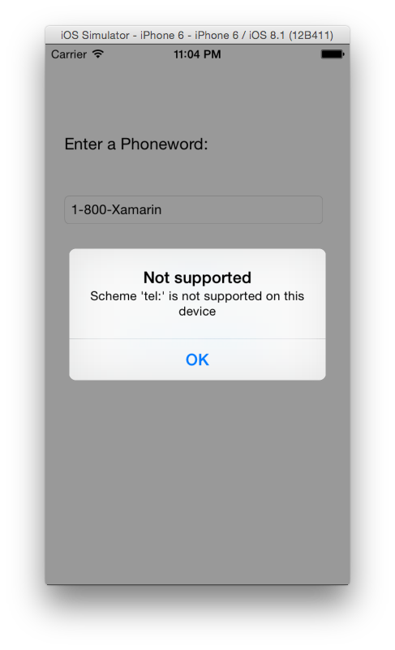

	This is because the simulator does not have a working phone application. If we were to test this on a real device, the call would go successfully.

14. We have now finished the basic functionality of our app, but it looks very unprofessional. Let's polish our app and make it look slick, by editing the information properties, or **info.plist** file. Double-Click on **info.plist**, which will open a screen similar to the one shown below:
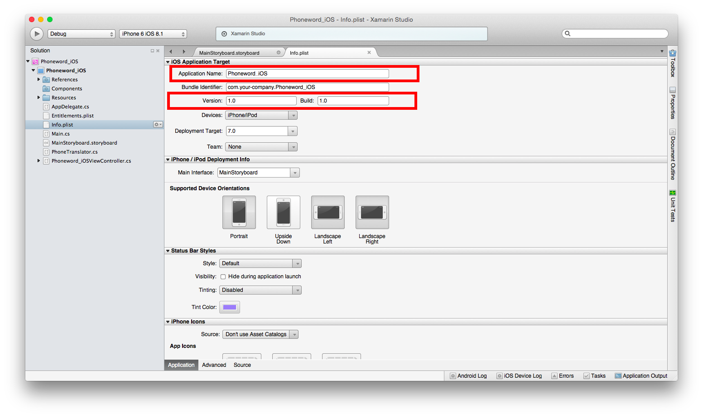
15. Edit the application name to just **Phoneword**.
16. Further on down this page, we can add app icons, spotlight icons, and splash screens. There is a related folder 'App Resources' with this guide that contains assets we can use for our icons. To change these icons, click on the placeholder and browse to **App Resource**'s location, as illustrated below:
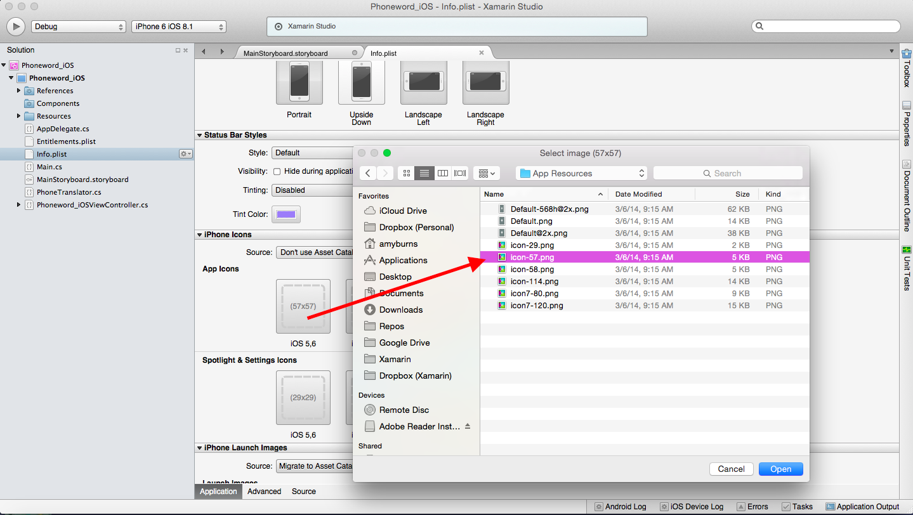
17. Deploy the application to the simulator one final time, and select **Hardware > Home Button** from the Menu Bar to return to the simulator's home screen. We can see it now has an icon, and a non-truncated name, as shown below:  
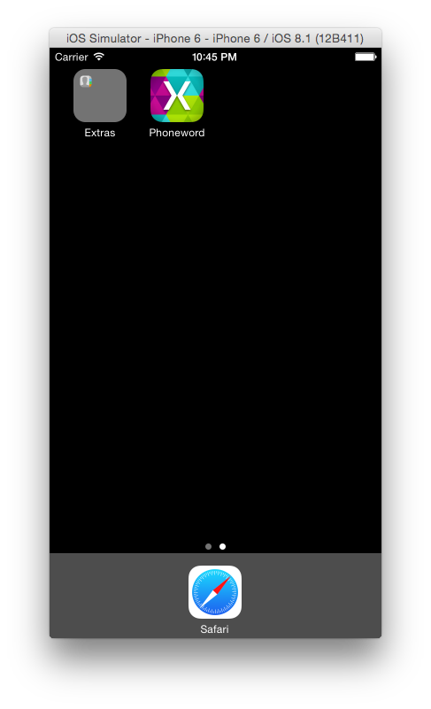

Congratulations! You have now built, and run your very first Xamarin application. We hope this will be the first of many!


#Related Links

- [Creating a Xamarin Account](https://store.xamarin.com/account/register)
- [Beginning a Trial](http://developer.xamarin.com/guides/cross-platform/getting_started/beginning_a_xamarin_trial/)
- [Intro to Xamarin Studio](http://developer.xamarin.com/guides/cross-platform/getting_started/introducing_xamarin_studio/)
- [Introduction to the iOS Designer](http://developer.xamarin.com/guides/ios/user_interface/designer/)
- [Evolve 2014 - Diving into the Xamarin Designer for iOS](http://youtu.be/W4H9uLjoEjM)
- [Evolve 2014 - Become a Xamarin Studio Expert](http://youtu.be/ZQWdRQTrHTQ)
- [Evolve 2014 - All Videos](https://evolve.xamarin.com)

#What's next?

We have looked at some of the basics of Xamarin Studio, but this is only the beginning. The application we have build is only a Single screen application, when developing for iOS in a real world scenario it is likely that your application will have more than one screen. Visit our [Hello, iOS Multi-Screen](http://developer.xamarin.com/guides/ios/getting_started/hello,_iOS_multiscreen/) guide for a walkthrough and explanation on how this is done.

iOS is only one of the platforms targeted by Xamarin. Android is another popular platform that can be programmed for using Xamarin. We have Getting Started resources for Android, that will explore creating the same Phoneword application in Xamarin.Android. These can be found in the links below:

####Build your first Android application
- [Hello, Android](http://developer.xamarin.com/guides/android/getting_started/hello,android/)
- [Hello, Android Multi-Screen](http://developer.xamarin.com/guides/android/getting_started/hello,android_multiscreen/)
- [Android Activity Lifecycle](http://developer.xamarin.com/guides/android/application_fundamentals/activity_lifecycle/)

Having an Android and iOS project that do the same thing, in the same language is great. However it is worth nothing that we use the `PhoneTranslator.cs` class in both projects. This seems like a waste of time and memory, not to mention the complications that could present themselves if we want to optimise or add features in future. This is where the beauty of Cross Platform development comes in.
Using the likes of a PCL or Shared Project, we can have one `core` project that contains all our logic, and it is accessible from both platform independant projects. You can read more about building cross platform application in the guides below:

####Cross Platform applications
- [Building Cross Platform Applications](http://developer.xamarin.com/guides/cross-platform/application_fundamentals/building_cross_platform_applications/)
- [PCL information](http://developer.xamarin.com/guides/cross-platform/application_fundamentals/building_cross_platform_applications/sharing_code_options/#Portable_Class_Libraries)
- [Shared Projects](http://developer.xamarin.com/guides/cross-platform/application_fundamentals/building_cross_platform_applications/sharing_code_options/#Shared_Projects) 

###Xamarin Forms
Taking the concept above one step further, Xamarin.Forms allows developers to create natively backed, cross platform UIs. The User Interface is coded in C#, but rendered using the natively controls of the platforms.

You can read more about it [here](http://developer.xamarin.com/guides/cross-platform/xamarin-forms/), or view any of the plethora of videos from Evolve 2014 listed below:

- [XAML for Xamarin.Forms](http://youtu.be/x3JhCmH5yLo)
- [Xamarin.Forms is even cooler than you think](http://youtu.be/79SdhVjBwh0)
- [Building Cross-Platform Applications with Xamarin, Xamarin.Forms and MVVM Light](http://youtu.be/FrcVQGTXZKM)
- [Your First Xamarin.Forms App](http://youtu.be/xWyOcEpNyXQ)
- [Extending Xamarin.Forms with Custom Controls](http://youtu.be/pIZ8G47KPIM)
 

#You mentioned Indie Licenses – What's the deal dude?!

This is true, I did! Everone who attended today's meetup will recieve a one month free indie license so that you can hack to your hearts content. You can see what this consists of on the [store page](https://store.xamarin.com/). After a month, you will have the option to use the 30-Day free (business) trial or continue to use indie for $25 per month.

To get your months free trial, you will need to have a Xamarin account, which you can sign up for [here](https://store.xamarin.com/account/register). Make sure you have either:

- Given us your Xamarin account address at the Meetup  
	**OR**
- Email your Xamarin account address to Jayme@xamarin.com (and CC amy@xamarin.com). Include the subject 'WCC - Indie License'

Remember students can now use Xamarin for free! For more information on this, vist the [student homepage](http://xamarin.com/student)


	 
